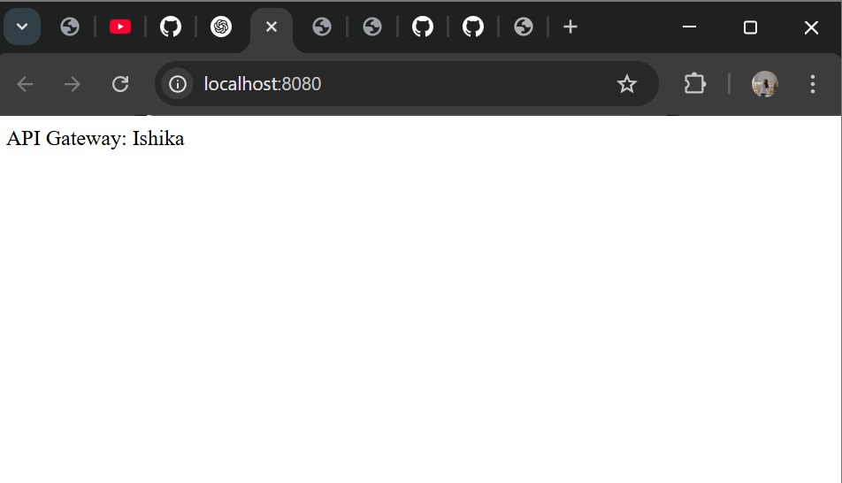

# Microservices Architecture with Docker Swarm ⚓

This guide explains how to deploy a microservices architecture using Docker Swarm with an API Gateway and a Backend Service.

## Docker to Swarm

### 🚀 Step 1: Install Docker & Initialize Docker Swarm

**1.1 Install Docker**
Ensure Docker is installed on your machine. Verify with:

```powershell
docker --version
```
If not installed, download it from Docker's official site and install it.

> **Note:** Docker Desktop should be running in the background for Docker Swarm to work properly.

**1.2 Initialize Docker Swarm**
Start Docker Swarm:

```powershell
docker swarm init
```
This makes your machine the Swarm Manager.

## 📁 Project Structure
```
microservices-docker-swarm/
│── backend-service/
│   ├── backend.py
│   ├── Dockerfile
│
│── api-gateway/
│   ├── api_gateway.py
│   ├── Dockerfile
│
│── docker-compose.yml
│── README.md
```

### 🛠 Step 2: Create the Microservices Code

**Backend Service**
Create `backend.py`:

```python
from flask import Flask

app = Flask(__name__)

@app.route('/')
def hello():
    return "Ishika"

if __name__ == "__main__":
    app.run(host='0.0.0.0', port=5000)
```

Create `Dockerfile`:

```dockerfile
FROM python:3.9-slim
WORKDIR /app
COPY backend.py /app
RUN pip install flask
CMD ["python", "backend.py"]
```

**API Gateway Service**
Create `api_gateway.py`:

```python
from flask import Flask
import requests

app = Flask(__name__)

@app.route('/')
def hello():
    backend_response = requests.get('http://backend-service:5000')
    return f"API Gateway: {backend_response.text}"

if __name__ == "__main__":
    app.run(host='0.0.0.0', port=8080)
```

Create `Dockerfile`:

```dockerfile
FROM python:3.9-slim
WORKDIR /app
COPY api_gateway.py /app
RUN pip install flask requests
CMD ["python", "api_gateway.py"]
```

### 📦 Step 3: Build Docker Images
```powershell
docker build -t backend-service ./backend-service
docker build -t api-gateway ./api-gateway
docker images
```

### 📝 Step 4: Create Docker Compose File for Swarm

Create `docker-compose.yml`:

```yaml
version: '3.7'

services:
  backend-service:
    image: localhost:5000/backend-service
    deploy:
      replicas: 2
      restart_policy:
        condition: on-failure
    networks:
      - app-network
    ports:
      - "5000:5000"

  api-gateway:
    image: localhost:5000/api-gateway
    deploy:
      replicas: 2
      restart_policy:
        condition: on-failure
    networks:
      - app-network
    ports:
      - "8080:8080"
    depends_on:
      - backend-service

networks:
  app-network:
    driver: overlay
```

### 🚀 Step 5: Deploy the Microservices to Docker Swarm
```powershell
docker stack deploy -c docker-compose.yml my_microservices
```

### 📊 Step 6: Verify the Deployment
```powershell
docker stack services my_microservices
docker ps
```

### 🌐 Step 7: Access the Microservices
Open your browser and go to:

```
http://localhost:8080
```
You should see: **API Gateway: Ishika**



 now go to:

```
http://localhost:5000
```
You should see: ** Ishika**


### 🛠 Step 8: Scaling the Services
```powershell
docker service scale my_microservices_backend-service=5
docker stack services my_microservices
```

### 🛠 Step 9: Updating the Services
Rebuild and update the backend service:

```powershell
docker build -t localhost:5000/backend-service ./backend-service
docker service update --image localhost:5000/backend-service:latest my_microservices_backend-service
```

### ⏹ Step 10: Remove the Stack
```powershell
docker stack rm my_microservices
docker swarm leave --force
```

This guide helps you deploy a microservices architecture using Docker Swarm. ✨

